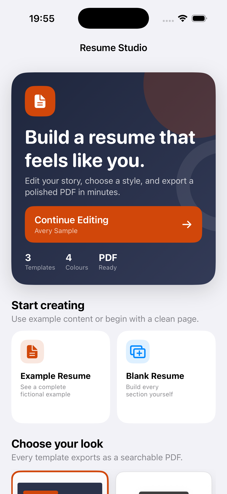

# ResumeStudio

ResumeStudio is a native SwiftUI app for building polished, export-ready resumes on iPhone and iPad.



## MVP features

- Structured editing for personal details, profile, competencies, experience, education, and references
- Automatic local draft persistence
- Reordering and deletion of repeatable sections
- Three distinct PDF templates: Modern Executive, Classic Editorial, and Clean Minimal
- Four accurately previewed accent colours
- Data-driven, automatically paginated PDF generation
- Live PDFKit preview
- Files export and iOS share sheet support
- Built-in fictional example and blank-resume starting points
- Versioned sample-data migration so legacy development data is not retained

## Architecture

- `Models/ResumeDocument.swift`: platform-neutral, Codable resume data
- `Services/ResumePDFRenderer.swift`: reusable PDF layout and pagination engine
- `Services/ResumeStore.swift`: local JSON draft persistence
- `Views/`: SwiftUI editor and PDF preview flows
- `Support/`: file export and share-sheet adapters

The renderer is intentionally separated from the editor so additional templates can be added without changing how resume data is stored.

## Run

1. Open `ResumeStudio.xcodeproj` in Xcode 26 or newer.
2. Select the `ResumeStudio` scheme.
3. Run on an iPhone or iPad simulator running iOS 17 or newer.

## Tests

```sh
xcodebuild -project ResumeStudio.xcodeproj \
  -scheme ResumeStudio \
  -destination 'platform=iOS Simulator,name=iPhone 17 Pro' \
  test
```
